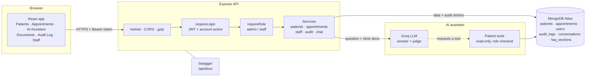

# System architecture

Every request goes through the same checks before it touches data. The frontend never talks to MongoDB or Groq directly, and the API key stays on the server.

```mermaid
flowchart LR
    subgraph Browser
        UI["React app<br/>Patients · Appointments · AI Assistant<br/>Documents · Audit Log · Staff"]
    end

    subgraph API["Express API"]
        direction LR
        MW["helmet · CORS · gzip"] --> Auth["requireLogin<br/>JWT + account active"] --> Role["requireRole<br/>admin / staff"] --> Svc["Services<br/>patients · appointments<br/>staff · audit · chat"]
    end

    subgraph AI["AI assistant"]
        direction TB
        LLM["Groq LLM<br/>answer + judge"]
        Tools["Patient tools<br/>read-only, role-checked"]
    end

    DB[("MongoDB Atlas<br/>patients · appointments · users<br/>audit_logs · conversations · faq_sections")]
    Docs["Swagger<br/>/api/docs"]

    UI -- "HTTPS + Bearer token" --> MW
    Svc -- "data + audit entries" --> DB
    Svc -- "question + clinic docs" --> LLM
    LLM -. "requests a tool" .-> Tools
    Tools --> DB
    API --- Docs
```
